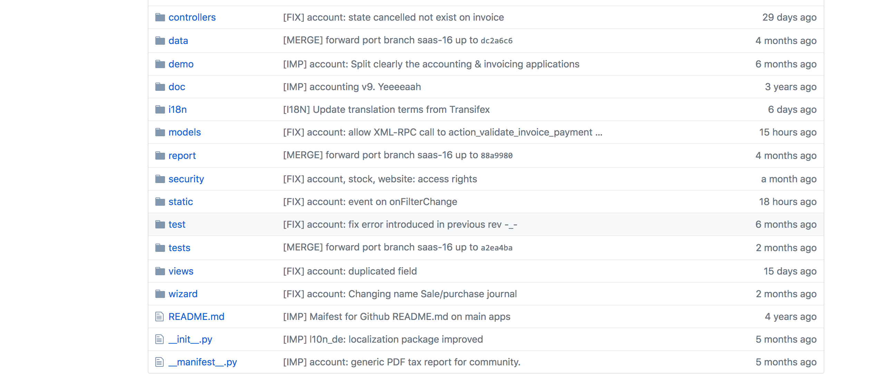

## Objectives pour cette session

- Récapitulation.
- Fichiers de données dans Odoo.
- FRONT-END D'ODOO.
- Modules dans ODOO.
- Installation d'Odoo.
- Méthode agile et flux git.


## Recapitulation de la derniere session

- **OOP**: Objets vs Class, Encapsulation, Héritage, Polymorphisme.
- **ORM**: La façon dont les objets crées au niveau applicatif, sont transformés au niveau persistance ( Base de donée).
- **Odoo ORM**: La class Model qui est héritée par tous les autres models dans Odoo:


```python
class BaseModel(...)
    ...
    @api.model
    def _add_magic_fields(self):
	    ...
		add('create_uid', fields.Many2one('res.users', string='Created by', automatic=True))
	    add('create_date', fields.Datetime(string='Created on', automatic=True))
	    add('write_uid', fields.Many2one('res.users', string='Last Updated by', automatic=True))
		add('write_date', fields.Datetime(string='Last Updated on', automatic=True))
	    ...
	...
	
	@api.model
    @api.returns('self', lambda value: value.id)
    def create(self, vals):
	    ...
	@api.multi
    def write(self, vals):
	    ...
	@api.multi
    def unlink(self):
	    ...
	def browse(self, arg=None, prefetch=None):
        ...
    @api.returns(..)
    def search(self, args, offset=0, limit=None, order=None, count=False):
	    ...
	@api.multi
    def read(self, fields=None, load='_classic_read'):
	    ...
	
	AbstractModel = BaseModel
```


```python
class Model(AbstractModel):
    """ Main super-class for regular database-persisted Odoo models.
    Odoo models are created by inheriting from this class::
        class user(Model):
            ...
    The system will later instantiate the class once per database (on
    which the class' module is installed).
    """
    _auto = True                # automatically create database backend
    _register = False           # not visible in ORM registry, meant to be python-inherited only
    _abstract = False           # not abstract
    _transient = False          # not transient

```


```python
...
from odoo import api, fields, models
...
class PartnerCategory(models.Model):
    _description = 'Partner Tags'
    _name = 'res.partner.category'
    _order = 'parent_left, name'
    _parent_store = True
    _parent_order = 'name'

    name = fields.Char(string='Tag Name', required=True, translate=True)
    color = fields.Integer(string='Color Index')
    parent_id = fields.Many2one('res.partner.category', string='Parent Category', index=True, ondelete='cascade')
    child_ids = fields.One2many('res.partner.category', 'parent_id', string='Child Tags')
    active = fields.Boolean(default=True, help="The active field allows you to hide the category without removing it.")
    parent_left = fields.Integer(string='Left parent', index=True)
    parent_right = fields.Integer(string='Right parent', index=True)
    partner_ids = fields.Many2many('res.partner', column1='category_id', column2='partner_id', string='Partners')
    ...   
```


```sql
 create table res_partner_category
(
	id serial not null
		constraint res_partner_category_pkey
			primary key,
	parent_left integer,
	parent_right integer,
	name varchar not null,
	color integer,
	parent_id integer
		constraint res_partner_category_parent_id_fkey
			references res_partner_category
				on delete cascade,
	active boolean,
	create_uid integer
		constraint res_partner_category_create_uid_fkey
			references res_users
				on delete set null,
	create_date timestamp,
	write_uid integer
		constraint res_partner_category_write_uid_fkey
			references res_users
				on delete set null,
	write_date timestamp
);
```


## Fichiers de données dans Odoo:
- Les fichiers de données dans Odoo sont des fichiers XML avec une syntaxe spécifique.
- Ces fichiers XML sont utilisés pour:
    - Charger les données lors de l'installation du module.
    - Utiliser comme données de démonstration et jeux de tests.
    - Définir les vues de l'interface utilisateur.
> Odoo is a highly data driven system. Although behavior is customized using Python code part of a module's value is in the data it sets up when loaded.


```xml
<odoo>

    <record model="{model name}" id="{record identifier}">
        <field name="{a field name}">{a value}</field>
    </record>

</odoo>
```
- **id**: est un *identifiant externe*, il permet de se référer à l'enregistrement (sans avoir à connaître son identifiant interne).

> A ne pas confondre avec l'**ID** dans les modèles.

```python
...
self.env.ref('{model name}.{record identifier}') 
...
```


## Front-end d'Odoo

- Le front-end Odoo est aussi un framework Javascript basé sur le framework Backbone.
- Les vues dans Odoo sont définies en utilisant du XML:

```xml
<record model="ir.ui.view" id="view_id">
    <field name="name">view.name</field>
    <field name="model">object_name</field>
    <field name="priority" eval="16"/>
    <field name="arch" type="xml">
        <!-- view content: <form>, <tree>, <graph>, ... -->
    </field>
</record>
```


- L'interface Odoo est composée de 4 parties:
	 1. **Menus Principales**: ils peuvent également être appelés applications.
	 2. **Sous menus et actions**: Les actions sont des liens entre le menu et le contenu à afficher par le menu.
	 3. **Recherches et options**: Les recherches sont utilisées pour filtrer le contenu et les options sont appliquées à ce contenu.
	 4. **Contenu Principale**: Tree / Form/ Kanban/ Calendar/ Graphs .


- Form View:
```xml
<?xml version="1.0" encoding="utf-8"?>
<odoo>
...
     <record id="view_partner_category_form" model="ir.ui.view">
        <field name="name">Contact Tags</field>
        <field name="model">res.partner.category</field>
        <field name="arch" type="xml">
            <form string="Contact Tag">
                <group col="4">
                    <field name="name"/>
                    <field name="active"/>
                    <field name="parent_id"/>
                </group>
            </form>
        </field>
     </record>
...
</odoo>
```


- Tree View:
```xml
<?xml version="1.0" encoding="utf-8"?>
<odoo>
...
    <record id="view_partner_category_list" model="ir.ui.view">
        <field name="name">Contact Tags</field>
        <field name="model">res.partner.category</field>
        <field eval="6" name="priority"/>
        <field name="arch" type="xml">
            <tree string="Contact Tags">
                <field name="display_name"/>
            </tree>
        </field>
    </record>
...
</odoo>
```


- Action View:
```xml
<?xml version="1.0" encoding="utf-8"?>
<odoo>
...
    <record id="action_partner_category_form" model="ir.actions.act_window">
        <field name="name">Contact Tags</field>
        <field name="type">ir.actions.act_window</field>
        <field name="res_model">res.partner.category</field>
        <field name="view_type">form</field>
        <field name="help" type="html">
            <p class="oe_view_nocontent_create">
                Click to create a new partner tag.
            </p>
            <p>
            ...
            </p>
        </field>
    </record>
...
</odoo>
```


- Menus:
```xml
<?xml version="1.0" encoding="utf-8"?>
<odoo>
...
    <menuitem name="Contacts"
              id="menu_contacts"
              sequence="4"
              web_icon="contacts,static/description/icon.png"
              groups="base.group_user,base.group_partner_manager"/>
...
    <menuitem id="menu_partner_category_form"
              action="base.action_partner_category_form"
              name="Contact Tags"
              sequence="1" parent="res_partner_menu_config"/>    
...
</odoo>
```


## Modules dans Odoo:
- Odoo est un system modulaire.
- un **Module** peut être considéré comme une application à part entière, ou un ensemble de fonctionnalités supplémentaires à un module d'application existant.
- **Techniquement**: Un module est un package python avec un fichier **manifest** où les métadonnées du module sont spécifiées.
- L'ensemble des modules proposés par Odoo ou développés par les intégrateurs sont appelés **addons**.


- `__manifest__.py` or `__openerp__.py` dans les versions précédentes:
```python
# -*- coding: utf-8 -*-
# Copyright {date} {company}
# License AGPL-3.0 or later (http://www.gnu.org/licenses/agpl).
{
    'name': " Module Name",
    'description': """
        Module description""",
    'version': '10.0.1.0.0',
    'license': 'AGPL-3',
    'author': 'Company Name',
    'website': 'www.company.com',
    'depends': ['module 1', 'module 2', ...],
    'data': [ 'data/file_1.xml',
              'views/{model_name}_view.xml',
              ...],
    'demo': ['demo/{model_name}.xml', ...],
    ...
}
```


- L'architecture d'un module:




## Installation D'ODOO

1. Avant de commencer toute installation dans Linux, mettez à jour les paquets:
```Shell
sudo apt-get update
sudo apt-get dist-upgrade
```

2. **PIP** est un gestionnaire de paquets utilisé pour installer et gérer des paquets écrits en Python:
```Shell
sudo apt-get install python-pip
```

3. **Less CSS** via nodejs:
```Shell
sudo apt-get install -y npm
sudo ln -s /usr/bin/nodejs /usr/bin/node
sudo npm install -g less
```
4. Outils requis pour créer des dépendances Odoo:
```Shell
pip install build-essential python-dev libxslt-dev libzip-dev libldap2-dev libsasl2-dev
```
> **python-dev** dépend de la version de python utilisée


### 5. GIT
- **Git** est un logiciel de gestion de version: 
- Permet d'obtenir toujours les dernières mises à jour.
- Installation:
```Shell
sudo apt-get install git
```
- S'assurer qu'il est bien installé:
 ```Shell
git --version
```
- Configuration:
```Shell
git config --global user.name "User Name"
git config --global user.email "user@email.com"
```


- Initialisation:
```Shell
mkdir working_directory
cd working_directory
git init
```

- Pour Odoo nous allons cloner le dépôt (i.e Repo):
```Shell
git clone https://github.com/odoo/odoo.git
```

- Liens utiles pour apprendre Git:
    - https://www.atlassian.com/git/tutorials/setting-up-a-repository
    - http://gitready.com/


### 6. Virtualenv & Virtualenvwrapper:
- Virtualenv est un outil pour créer des environnements isolés Python.
- Nous allons utiliser **`virtualenvwrapper`** qui est un ensemble de scripts qui facilitent l'utilisation de virtualenv.
```Shell
sudo pip install virtualenvwrapper
```
- Dans `.bashrc` et `.profile` ajouter:
```Shell
export WORKON_HOME=$HOME/.virtualenvs
source /usr/local/bin/virtualenvwrapper.sh
```
- executer: `source ~/.bashrc`.


- Creation d'un nouveau virtualenv:
```Shell
cd working_directory
mkvirtualenv {venv} -a .
```

- Pour spécifier la version de python à utiliser:
```Shell
mkvirtualenv -p /usr/bin/python{3|2} {venv} -a .
```

- Quitter et travailler sur le virtualenv:
```Shell
deactivate
workon {venv}
```

- Supprimer un virtuelenv:
```
deactivate
rmvirtualenv {venv}
```


### 7. PostgreSQL
- Installation:
```Shell
sudo apt-get install postgresql
```
- L'utilisateur root du serveur postgresql est un utilisateur système appelé `postgres`:
```Shell
sudo su  postgres
createuser --createdb --username postgres --no-createrole --no-superuser --pwprompt odoo
Enter password for new role: ********
Enter it again: ********
```
- Quitter le compute utilisateur `postgres`:
```Shell
exit
```


- Creation d'un backup de la BD:
```Shell
pg_dump -Fp|c -h localhost -U odoo -d {db_name} -f {db_name_backup}.sql|dump
```
- Restoration d'un backup de BD en SQL:
```Shell
sudo su  postgres
createdb --owner odoo {db_name}
psql {db_name} < /path/to/backup/{db_name_backup}.sql
```

- Restoration d'un backup de BD avec un fichier **dump**:
```Shell
pg_restore -U odoo --no-owner  --dbname {db_name} /path/to/backup/{db_name_backup}.dump
```
- https://www.youtube.com/watch?v=knUitQQnpJo


### 8. Mise en place de l'environnement de DEV
- Initialisation:
```shell
mkdir working_directory
cd working_directory
git clone https://github.com/odoo/odoo.git --depth 1 --branch {odoo_version} --single-branch
cd odoo
```
- Créer un virtualenv:
```shell
mkvirtualenv odoo-{project_name} -a .
```
- Installer les dependences d'Odoo
```shell
pip install -r requirements.txt
```
- Lancer Odoo:
https://www.odoo.com/documentation/11.0/reference/cmdline.html
```Shell
python odoo-bin --db_host=localhost -r odoo -w {password} --addons-path=addons,../myaddons
```


- S'assurer que Odoo est lancé:
```Shell
# ps aux | grep odoo-bin
zakaria          63694   0.0  0.5  2588648  92056 s002  S+    3:47PM   0:02.51 python3 odoo-bin --db_host=localhost -r odoo -w qazedcsdispo
```

- Initialisation d'une nouvelle DB:
```Shell
python odoo-bin --db_host=localhost -r odoo -w {password} --addons-path=addons,../myaddons
-d {db_name} [-without-demo=WITHOUT_DEMO]
```

- Installation d'un module:
```Shell
python odoo-bin --db_host=localhost -r odoo -w {password} -d {db_name}
--addons-path=addons,../myaddons -i {module_name} [-without-demo=WITHOUT_DEMO]
```

- Mise à jour d'un module:
```Shell
python odoo-bin --db_host=localhost -r odoo -w {password} -d {db_name}
--addons-path=addons,../myaddons -i {module_name} [-without-demo=WITHOUT_DEMO]
```


### OCA
- Odoo Community Association: une organisation à but non lucratif.
- S'assurer que Odoo continue en tant qu'un projet Open Source.
- Une valeur ajoutée sûr en termes de fonctionnalités Odoo.
- Pour utiliser les modules OCA:
```Shell
cd working_directory
git clone https://github.com/OCA/{repo_name}.git
python odoo-bin --db_host=localhost -r odoo -w {password} --addons-path=addons,../myaddons,../{repo_name}
```


# Alternative d'installation


## Problèmes rencontrés
- Comment être sûr de toujours travailler avec la dernière version d'Odoo?
- Comment inclure une correction de bug sans risque et sans en introduire de nouveaux.
- Comment être sûr d'utiliser la bonne version du module OCA.
- Ça doit être une autre façon de faire les choses.
- Odoo est développé autour d'outils puissants, pourquoi ne pas utiliser la force de ces outils pour améliorer notre système écologique.


- **ACSOO**: Un ensemble d'utilitaires de ligne de commande pour faciliter le workflow de développement Odoo chez **Acsone**.
- `L'idée est simple`: rendre Odoo et les modules Odoo (même les modules OCA) installables en utilisant **PIP** comme n'importe quelle autre paquets utilisée.
- Installation:
```Shell
pip install acsoo
or
workon {venv}
pip install acsoo
```
- Initialiser un nouveau projet:
```Shell
mrbob acsoo:templates/project
cd {project name}
git init
mkvirtualenv {project name} -a .
```

- pour économiser du temps copier odoo dans `src/odoo` et faire:

```Shell
pip install --src src --pre -r requirements-dev.txt
...
Obtaining odoo from git+ssh://git@github.com/acsone/odoo.git@10.0-gft_master#egg=odoo (from -r requirements-dev.txt (line 5))
  git clone in ./src/odoo exists with URL https://github.com/odoo/odoo.git
  The plan is to install the git repository ssh://git@github.com/acsone/odoo.git
What to do?  (s)witch, (i)gnore, (w)ipe, (b)ackup i
...
./freeze.sh

python odoo-bin --db_host=localhost -r odoo -w {password}

addons paths: ['/home/genisoft/.local/share/Odoo/addons/10.0', u'/home/genisoft/genisoft/src/odoo/odoo/addons', u'/home/genisoft/genisoft/src/odoo/addons', '/home/genisoft/.virtualenvs/odoo-genisoft/lib/python2.7/site-packages/odoo/addons', '/home/genisoft/genisoft/odoo/addons']
```


- Pour installer un module OCA:
```Shell
export PIP_FIND_LINKS="https://wheelhouse.odoo-community.org/oca"
pip install odoo{9|10|11}-addon-<name_of_module>
```

- **GIT-AGGREGATOR**:
- Permet de faire la consolidation de plusieurs versions (i.e branche/pull requests/Repo) pour construire une version consolidée.
- Utilise un fichier `**.yml**` pour la configuration:

```YML
./product_attribute:
    remotes:
        oca: https://github.com/OCA/product-attribute.git
        acsone: git+ssh://git@github.com/acsone/product-attribute.git
    merges:
        - oca 8.0
        - oca refs/pull/105/head
        - oca refs/pull/106/head
    target: acsone aggregated_branch_name

./connector-interfaces:
    remotes:
        oca:  https://github.com/OCA/connector-interfaces.git
        acsone:  https://github.com/acsone/connector-interfaces.git
    merges:
        - oca 6054de2c4e669f85cec380da90d746061967dc83
        - acsone 8.0-connector_flow
        - acsone 80_connector_flow_ir_cron_able-lmi
        - acsone 8.0_connector_flow_improve_eval_config
    target: acsone aggregated_branch_name
    fetch_all:
        - oca
```


- Pour obtenir la version souhaitée:
```Shell
gitaggregate -c gitaggregate.yaml -d src/{repo_name} -p
```

- Il faut belle est bien avoir un compte github et une copie (Fork) pour tous les repos utilisés dans le projet.

