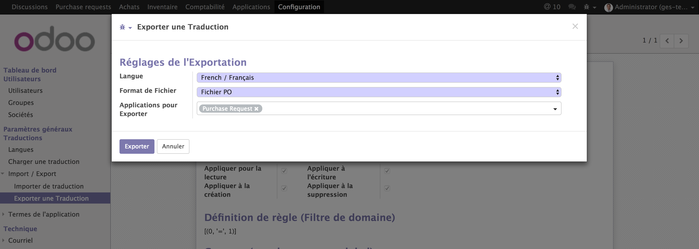

## Odoo en profondeur 2


## L'Héritage dans Odoo

- L'héritage est un concept largement utilisé dans Odoo, il donne la flexibilité à l'ensemble du framework:

    - Héritage au niveau des modules: exprimé à travers les dépendances entre les modules.

    - Héritage au niveau des modèles: Traditional inheritance, Delegation inheritance.
    
    - Héritage au niveau des vues: Permet d'ajouter plus d'éléments à une vue existante.


### Héritage au niveau des modèles
- Héritage traditionnel: a le même mécanisme que l'héritage de programmation orienté objet:
    - ajouter des champs à un modèle ou remplacer la définition des champs sur un modèle,
    - ajouter des méthodes à un modèle ou remplacer les méthodes existantes sur un modèle.
```python
Class Model1(models.Model):
    _name = 'model.1'

    name = fields.Char(string='Nom 1', required=True,)
    ...
    @api.multi
    def action_do_something(self):
        for rec in self:
            rec.name = 'something'
    ...
Class Model2(models.Model):
    _inherit = 'model.1' # _inherit = ['model.1', 'model.3', ...]
    # _name = 'model.2' ==> New model created

    name = fields.Char(readonly=True, default='something else',)

    @api.multi
    def action_do_something(self):
        rec_with_no_names = self.filter(lambda: not rec.name)
        if rec_with_no_name:
            return super(Model2, rec_with_no_names).action_do_something()
```


- **Héritage par délégation**: permet de lier chaque enregistrement d'un modèle à un enregistrement dans un modèle parent et fournit un accès transparent aux champs de l'enregistrement parent. 

```Python
Class ResourceResource(models.Model):
    _name = 'resource.resource'
    _description = 'Resource Detail'

    name = fields.Char(required=True)
    code = fields.Char(copy=False)
    active = fields.Boolean(track_visibility='onchange', default=True, ...)
    ...
Class Employee(models.Model):
    _name = "hr.employee"
    _description = "Employee"
    _order = 'name_related'
    _inherits = {'resource.resource': "resource_id"}

    resource_id = fields.Many2one('resource.resource', string='Resource',
        ondelete='cascade', required=True, auto_join=True)
```


### Héritage au niveau des vues
```XML
    <record id="product_template_form_view" model="ir.ui.view">
        <field name="name">product.template.form.inherit</field>
        <field name="model">product.template</field>
        <field name="priority">5</field>
        <field name="inherit_id" ref="product.product_template_form_view"/>
        <field name="arch" type="xml">
            <page name="sales" position="after">
                ...
            </page>
        </field>
    </record>

    <xpath expr="//field[@name='description']" position="after">
        <field name="idea_ids" />
    </xpath>

    <field name="description" position="after">
        <field name="idea_ids" />
    </field>
```


# La Sécurité dans Odoo

- Odoo fournit deux principaux mécanismes gérer ou restreindre l'accès aux données:
    - Access Control (ACL).
    - Record Rules (RRL).
- Les deux mécanismes sont appliqués sur les groupes d'utilisateurs.
- un utilisateur appartient à un nombre quelconque de groupes, et les mécanismes de sécurité sont associés à des groupes.
- On définit les pérmissions relative aux CRUD: create, read, update(write), delete(unlink).
- les ACL et les RRL sont des données définies en utilisant du XML.


- **Groupes**:
```XML
.../my_addons/my_module/security/{module_name}_groups.xml
    <record model="ir.module.category" id="my_security_category">
        <field name="name">My Groupes</field>
        <field name="sequence">21</field>
    </record>

    <record id="my_group_1" model="res.groups">
        <field name="name">My group 1</field>
        <field name="category_id" ref="my_module.my_security_category"/>
        <field name="users" eval="[(4, ref('base.user_root'))]"/>
    </record>
```


- **Acess Control**: 
```XML
.../my_addons/my_module/security/{my_model}_acl.xml

    <record model="ir.model.access" id="{my_model}_{my_group}_acl">
        <field name="name">{my.module}.{my.group}.access</field>
        <field name="model_id" ref="{my_module}.model_{my_model_name}"/>
        <field name="group_id" ref="{my_module}.{my_security_category}"/>
        <field name="perm_read" eval="1"/>
        <field name="perm_create" eval="0"/>
        <field name="perm_write" eval="0"/>
        <field name="perm_unlink" eval="0"/>
    </record>
    ...
```


-**Record rules**:
```XML
.../my_addons/my_module/security/{my_group}_record_rules.xml
    <record model="ir.rule" id="res_partner_base_user_write_access_rule">
        <field name="name">silog base user write res.partner.access.rule</field>
        <field name="model_id" ref="base.model_res_partner"/>
        <field name="domain_force">[my domain]</field>
        <field name="perm_read" eval="1"/>
        <field name="perm_create" eval="0"/>
        <field name="perm_write" eval="0"/>
        <field name="perm_unlink" eval="0"/>
        <field name="groups" eval="[(6, 0, [ref('base.group_user')])]"/>
    </record>
```


### Interaction entre les règles
- Les règles globales (non spécifiques à un groupe) sont restrictives et ne peuvent pas être contournées.
- Les règles propres à un groupe permettent d'accorder des autorisations supplémentaires, mais elles sont limitées par celles définies au niveau global.
- Les règles du premier groupe sont plus restrictives que les règles globales, mais n'importe quel groupe de règles supplémentaire ajoutera plus d'autorisations.
- **Algorithme détaillé:**
    1. Les règles globales sont évaluées avec un ET logique entre elles, et avec le résultat des étapes suivantes
    2. Règles spécifiques au groupe combinées ensemble avec un opérateur logique OU
    3. Lorsqu'un utilisateur appartient à plusieurs groupes, les résultats de l'étape 2 sont combinés avec un opérateur OU
    4. Exemple : GLOBAL_RULE_1 AND GLOBAL_RULE_2 AND ( (GROUP_A_RULE_1 OR GROUP_A_RULE_2) OR (GROUP_B_RULE_1 OR GROUP_B_RULE_2) )


- Note Importantes:
    - Si ACL  n'est pas définie pour un modèle, le modèle n'est accessible que par l'utilisateur admin.
    - Il est préférable d'avoir toujours un accès séparé pour la lecture et un autre accès pour l'écriture.
    - ACL/RRL are always checked when trying to access a given modèle.
    - Vous devez être très attentif aux droits d'accès pour les champs  **Many2one** et **One2many**.
    - Il est possible de contourner la utilisant la méthode **sudo()**
    ```Python
        my_object.sudo().write({'field1: 'value'}).
    ```
    - Pour les champs calculés, on utilise les attributs **compute_sudo=True**, **related_sudo=True**.


## Tests unitaires

- est une procédure permettant de vérifier le bon fonctionnement d'une fonctionnalité développée.
- Le processus est simple:
    - Écrire une fonction de test qui doit obtenir un résultat défini dans les spécifications.
    - Écrire le code pour faire réussir le test.
    - Une fois le test en succès, rajouter un autre test pour obtenir un résultat légèrement différent, en faisant varier les entrées par exemple. Ce nouveau test fera faillir le code principal.
    - Modifier le code principal pour faire réussir les tests.
    - Recommencer, en éliminant et refactorisant les éventuelles redondances dans le code des tests.


```your_module
|-- ...
`-- tests
    |-- __init__.py
    |-- test_bar.py
    `-- test_foo.py
__init__.py
from . import test_foo, test_bar
```

```python
from openerp.tests.common import SavepointCase
Class TestPurchase(SavepointCase):

    @classmethod
    def setUpClass(cls):
        super(TestPurchase, cls).setUpClass()
        cls.order = cls.env['purchase.order'].create({
            'partner_id': cls.supplier1.id,
            'public_contract_id': cls.contract1.id
        })
        ...
        cls.main_product1 = cls.env.ref('product.product_product_8')
        ...
    ...
    def test_draft_state(self):
        self.assertEqual(self.order.state, 'draft')
        ...
        self.assertFalse(self.order.sc_action_draft_allowed)
        ...
        self.assertTrue(self.order.sc_action_to_approve_allowed)
        ...
        self.order.action_to_approve()
        self.assertEqual(self.order.state, 'to approve')
```


# Alternative d'installation


## Problèmes rencontrés
- Comment être sûr de toujours travailler avec la dernière version d'Odoo?
- Comment inclure une correction de bug sans risque et sans en introduire de nouveaux.
- Comment être sûr d'utiliser la bonne version du module OCA.
- Ça doit être une autre façon de faire les choses.
- Odoo est développé autour d'outils puissants, pourquoi ne pas utiliser la force de ces outils pour améliorer notre système écologique.


- **ACSOO**: Un ensemble d'utilitaires de ligne de commande pour faciliter le workflow de développement Odoo chez **Acsone**.
- `L'idée est simple`: rendre Odoo et les modules Odoo (même les modules OCA) installables en utilisant **PIP** comme n'importe quelle autre paquets utilisée.
- Installation:
```Shell
pip install acsoo
or
workon {venv}
pip install acsoo
```
- Initialiser un nouveau projet:
```Shell
mrbob acsoo:templates/project
cd {project name}
git init
mkvirtualenv {project name} -a .
```

- pour économiser du temps copier odoo dans `src/odoo` et faire:

```Shell
pip install --src src --pre -r requirements-dev.txt
...
Obtaining odoo from git+ssh://git@github.com/acsone/odoo.git@10.0-gft_master#egg=odoo (from -r requirements-dev.txt (line 5))
  git clone in ./src/odoo exists with URL https://github.com/odoo/odoo.git
  The plan is to install the git repository ssh://git@github.com/acsone/odoo.git
What to do?  (s)witch, (i)gnore, (w)ipe, (b)ackup i
...
./freeze.sh

python odoo-bin --db_host=localhost -r odoo -w {password}

addons paths: ['/home/genisoft/.local/share/Odoo/addons/10.0', u'/home/genisoft/genisoft/src/odoo/odoo/addons', u'/home/genisoft/genisoft/src/odoo/addons', '/home/genisoft/.virtualenvs/odoo-genisoft/lib/python2.7/site-packages/odoo/addons', '/home/genisoft/genisoft/odoo/addons']
```


- Pour installer un module OCA:
```Shell
export PIP_FIND_LINKS="https://wheelhouse.odoo-community.org/oca"
pip install odoo{9|10|11}-addon-<name_of_module>
```

- **GIT-AGGREGATOR**:
- Permet de faire la consolidation de plusieurs versions (i.e branche/pull requests/Repo) pour construire une version consolidée.
- Utilise un fichier `**.yml**` pour la configuration:

```YML
./product_attribute:
    remotes:
        oca: https://github.com/OCA/product-attribute.git
        acsone: git+ssh://git@github.com/acsone/product-attribute.git
    merges:
        - oca 8.0
        - oca refs/pull/105/head
        - oca refs/pull/106/head
    target: acsone aggregated_branch_name

./connector-interfaces:
    remotes:
        oca:  https://github.com/OCA/connector-interfaces.git
        acsone:  https://github.com/acsone/connector-interfaces.git
    merges:
        - oca 6054de2c4e669f85cec380da90d746061967dc83
        - acsone 8.0-connector_flow
        - acsone 80_connector_flow_ir_cron_able-lmi
        - acsone 8.0_connector_flow_improve_eval_config
    target: acsone aggregated_branch_name
    fetch_all:
        - oca
```


- Pour obtenir la version souhaitée:
```Shell
gitaggregate -c gitaggregate.yaml -d src/{repo_name} -p
```

- Il faut belle est bien avoir un compte github et une copie (Fork) pour tous les repos utilisés dans le projet.


# DEMO: DEMANDE D'ACHAT


- Créer un nouveau module en utilisant mrbob:

```Shell
~/.virtualenvs/acsoo/bin/mrbob bobtemplates.odoo:addon
...
--> Addon name (with underscores): purchase_request

--> Is it an OCA addon [n]: n

--> Summary: Purchase request

--> Version [10.0.1.0.0]:

--> Copyright holder name: SARL Genisoft

--> Copyright year: 2018

--> Website: www.example.com
```

- Ajouter un nouveau model: purchase.request:

```Shell
~/.virtualenvs/acsoo/bin/mrbob bobtemplates.odoo:model
--> Odoo version (8|9|10) [10]:

--> Model name (dotted notation): purchase.request

--> Inherit [y]: n

--> Form view [y]: y

--> Search view [y]: y

--> Tree view [y]: y

--> Action and menu entry [y]: y

--> ACL [y]: y

--> Demo data [y]: y

--> Copyright holder name: SARL genisoft

--> Copyright year: 2018
```

- Ajouter un nouveau modèle: purchase.request.line.
- mettre à jour les dépendances du modèle.


- Faire un premier teste en installant le module dans une nouvelle instance:

```Shell
src/odoo/odoo-bin --db_host=localhost -r odoo -w qazedcsdispo --db-filter="ges-" -d ges-test_1 -i purchase_request
2018-03-11 10:20:01,153 8629 INFO ? odoo: Odoo version 10.0
2018-03-11 10:20:01,153 8629 INFO ? odoo: addons paths: ['/Users/zakaria/Library/Application Support/Odoo/addons/10.0', u'/Users/zakaria/odoo_genisoft/project/odoo_genisoft/src/odoo/odoo/addons', u'/Users/zakaria/odoo_genisoft/project/odoo_genisoft/src/odoo/addons', '/Users/zakaria/.virtualenvs/odoo-genisoft/lib/python2.7/site-packages/odoo/addons', '/Users/zakaria/odoo_genisoft/project/odoo_genisoft/odoo/addons']
2018-03-11 10:20:01,153 8629 INFO ? odoo: database: odoo@localhost:default
2018-03-11 10:20:01,820 8629 INFO ? odoo.service.server: HTTP service (werkzeug) running on 0.0.0.0:8069
...
2018-03-11 10:22:33,053 8629 WARNING ges-test_1 odoo.modules.loading: The model purchase.request has no access rules, consider adding one. E.g. access_purchase_request,access_purchase_request,model_purchase_request,,1,0,0,0
2018-03-11 10:22:33,053 8629 WARNING ges-test_1 odoo.modules.loading: The model purchase.request.line has no access rules, consider adding one. E.g. access_purchase_request_line,access_purchase_request_line,model_purchase_request_line,,1,0,0,0
```

- Ajouter des views pour le modèle: purchase.request (form, tree, action, menus).

```XML
    ...
    <field name="field_name"
           attrs="{'readonly': [('field_name_2', '=|!=|&lt;|&gt;', value)],
                   'invisible': ..., 'required': ...}"/>
    ...
    <field name="product_id" domain="[('seller_ids.name', '=', parent.partner_id)]"/>
    ...
    <field name="product_uom" options="{'no_open':True,'no_create':True}" string="Unit of Measure" groups="product.group_uom"/>
    ...
    <!-- Need an OCA module: web_readonly_bypass -->
    <field name="supplier_id" options="{'readonly_by_pass': True}"/>
```


- Ajouter des testes unitaires:

```Shell
~/.virtualenvs/acsoo/bin/mrbob bobtemplates.odoo:test

--> Odoo version (8|9|10) [10]:

--> Test file name (with underscores): test_purchase_request

--> Copyright holder name: SARL Genisoft

--> Copyright year: 2018

Generated file structure at /Users/zakaria/odoo_genisoft/project/odoo_genisoft/odoo/addons/purchase_request
```

- La commande pour le lancer les testes unitaires et la suivante: 

```Shell
./odoo-bin --db_host=localhost -r odoo -w qazedcsdispo -d {db_name} -i {module_name} --test-enable --stop-after-ini

2018-03-18 08:21:23,891 26591 INFO ges-test_1 odoo.modules.module: odoo.addons.purchase_request.tests.test_purchase_request running tests.
2018-03-18 08:21:23,891 26591 INFO ges-test_1 odoo.addons.purchase_request.tests.test_purchase_request: test_1 (odoo.addons.purchase_request.tests.test_purchase_request.TestPurchaseRequest)
2018-03-18 08:21:23,986 26591 INFO ges-test_1 odoo.addons.purchase_request.tests.test_purchase_request: Ran 1 test in 0.095s
2018-03-18 08:21:23,987 26591 INFO ges-test_1 odoo.addons.purchase_request.tests.test_purchase_request: OK
2018-03-18 08:21:23,999 26591 INFO ges-test_1 odoo.modules.loading: 35 modules loaded in 1.17s, 62 queries
```


- Ajouter du code métier pour nos deux modèles: purchase.request et purchase.request.line
- les méthodes **onchange** et **compute** doivent être protégés:
```Python
...
    @api.onchange('my_field')
    def _onchange_my_field(self):
        ....

    @api.depends('some_fields')
    def _compute_my_field(self):
        ...
```


- Les méthodes utilisées par les bouttons dans l'interface doivent être visible par l'API:

```Python
...
    @api.multi
    def button_draft(self):
        ...
...
```

- Par conséquent: elles doivent être sécurisées d'avantage, la méthodes est la suivante:

```
...
    button_draft_allowed = fields.Boolean(
        compute='_compute_button_draft_allowed',
        store=True,
        readonly=True,
    )
    ...
    @api.multi
    @api.depends('state')
    def _compute_button_draft_allowed(self):
        has_group = self.env.user.has_group(
            'my_module.my_group')
        for rec in self:
            rec.button_draft_allowed = rec.state == 'cancel' and has_group

    @api.multi
    def _check_button_draft_allowed(self):
        if self.filtered(lambda r: not r.button_draft_allowed):
            raise AccessError("You don't have right")

    @api.multi
    def button_draft(self):
        self._check_button_draft_allowed()
        self.write({'state': 'draft'})
```

```XML
...
        <button name="button_draft"
                string="Reset"
                type="object"
                attrs="{'invisible': [('button_draft_allowed', '=', False)]}"/>
        ...
        <field name="button_draft_allowed" invisible="1"/>
...
```

- A partir de la version 10.0, Odoo a décidé d'abandonner son moteur de workflow et d'utiliser uniquement des boutons associés aux états.
- Il y a un module OCA qui essaie de remplacer le moteur, il s'appelle statechart: https://github.com/acsone/scobidoo


### La traduction dans Odoo:

- Chaque module fournit ses propres traductions dans un  répertoire i18n, en ayant des fichiers nommés **LANG.po**.
- **LANG** est le code de paramètres régionaux pour la langue: **fr.po** ou **fr_BE.po**.
```SHELL
|- my_module/
   |- i18n/ 
      | - idea.pot # Translation Template (exported from Odoo)
      | - fr.po # French translation
      | - pt_BR.po # Brazilian Portuguese translation
      | (...)
```
- Syntaxe du fichier:
```PO
#. module: purchase_request
#: model:ir.actions.act_window,name:purchase_request.purchase_request_act_window
#: model:ir.model,name:purchase_request.model_purchase_request
#: model:ir.model.fields,field_description:purchase_request.field_purchase_request_line_request_id
#: model:ir.module.category,name:purchase_request.module_category_purchase_request
#: model:ir.ui.menu,name:purchase_request.purchase_request_menu
#: model:ir.ui.view,arch_db:purchase_request.purchase_request_search_view
#: model:ir.ui.view,arch_db:purchase_request.purchase_request_tree_view
msgid "Purchase Request"
msgstr "Purchase Request"
```
- Pour mettre à jour les traduction, il suffit de mettre à jour le module en utilisant le flag: **--i18n-overwrite**
```Shell
odoo-bin --db_host=localhost -r odoo -w qazedcsdispo --db-filter="ges-" -d ges-test_4 -u purchase_request --i18n-overwrite
```


- La meilleure façon pour créer les fichiers PO, est de le faire via l'interface utilisateur:
    - **Settings ‣ Translations ‣ Import / Export ‣ Export Translations**




- Odoo automatiquement export les contenus traduisibles suivants:
    - Au niveau des views, les tags suivant sont automatiquements exportés: **string**, **help**, **sum**, **confirm**, **placeholder**.
    - Au niveau modéle: 
        - Les attributs des champs: **string**, **help**.
        - Pour les champs de type sélection: **selection**.
        - Le contenu d'un champ peut être traduisible avec l'attribut: **translate=True**.
        - Les messages d'erreur des contraintes: **_sql_constraints**
- Lorsqu'il s'agit de situations plus "impératives" en code Python ou en code Javascript, Odoo ne peut pas exporter automatiquement les termes traduisibles, ils doivent donc être marqués explicitement pour l'exportation. Ceci est fait en enveloppant une chaîne littérale dans un appel de fonction.
```Python
from odoo import api, fields, models, _
class PurchaseRequest(models.Model):
    ...
    @api.multi
    def to_approve_allowed_check(self):
        for rec in self:
            if not rec.to_approve_allowed:
                raise UserError(
                    _("You can't request an approval for a purchase request "
                      "which is empty. (%s)") % rec.name)
    ...
```
```PO
#. module: purchase_request
#: code:addons/purchase_request/models/purchase_request.py:183
#, python-format
msgid "You can't request an approval for a purchase request which is empty. (%s)"
msgstr "You can't request an approval for a purchase request which is empty. (%s)"
```


##  Notifications et messagerie dans Odoo:
- Odoo propose un mécanisme de communication (Chatter) lié à chaque modèle. Cette communication est établie par le biais d'un système de notification et de messagerie.
- pour intégration des fonctions de messagerie à un modèle:
```Python
class PurchaseRequest(models.Model):
    _name = 'purchase.request'
    _inherit = ['mail.thread']
    _description = 'Purchase Request'
```
```XML
<form>
    <sheet>
    ...
    </sheet>
    <div class="oe_chatter">
        <field name="message_follower_ids" widget="mail_followers"/>
        <field name="message_ids" widget="mail_thread"/>
    </div>
</form>
```


- Par défaut:
    - Lors de la publication d'un message ou d'une note, tous les abonnés du document (enregistrement) recevront une notification.
    - Tout utilisateur ayant un accès en écriture au document peut faire un post dans le chatter.
    - Tout utilisateur qui crée ou met à jour le document est automatiquement ajouté en tant que **follower**  à ce document.
- **mail.thread** offre des fonctions et des paramètres qui aident à changer le comportement par défaut:
- Pour pouvoir poster un message avec un accès en lecture seulement:
```Python
class PurchaseRequest(models.Model):
    _name = 'purchase.request'
    _inherit = ['mail.thread']
    _description = 'Purchase Request'
    _mail_post_access = 'read'
```
- Pour désactiver l'abonnement automatique au document lors de la création ou de la mise à jour d'un document:
    - **mail_create_nosubscribe**: A la création ou à l'appelle de la méthode `message_post`, n'ajouter pas automatiquement l'utilisateur courant au followers.
    - **mail_notrack**: L'utilisateur courant n'est pas automatiquement ajouter au followers du document crée ou modifié.
    - **tracking_disable**: Désactiver toute fonctionalité de notification.
```Python
self.env['my.module'].with_context(mail_create_nosubscribe=True, mail_notrack=True, tracking_disable=True).create(vals)
```


- **mail.thread** permet aussi de faire le logging des changements effectués sur un document: Ceci est fait en ajoutant l'attribut **track_visibility** à un champ:
    - **onchange**: Affiché le changement de ce champ que si ce champ lui même a changé de valeur.
    - **always**: Devrait toujours être affichée dans le chatter même si ce champ particulier n'a pas changé.
```python
class BusinessTrip(models.Model):
    _name = 'business.trip'
    _inherit = ['mail.thread']
    _description = 'Business Trip'

    name = fields.Char(track_visibility='always')
    partner_id = fields.Many2one('res.partner', 'Responsible',
                                 track_visibility='onchange')
    guest_ids = fields.Many2many('res.partner', 'Participants')
```


- **Subtypes**: agissent comme un système de classification pour les notifications, permettant aux abonnés d'un document de personnaliser les notifications qu'ils souhaitent recevoir.
- Les Subtypes sont créés en tant que données dans votre module:
```XML
<record id="mt_state_change" model="mail.message.subtype">
    <field name="name">Trip confirmed</field>
    <field name="res_model">business.trip</field>
    <field name="default" eval="True"/>
    <field name="description">Business Trip confirmed!</field>
</record>
```
- Ensuite, nous devons surcharger la fonction **track_subtype ()**. Cette fonction est appelée par le système de suivi pour savoir quel sous-type doit être utilisé en fonction de la modification en cours.
```Python
class BusinessTrip(models.Model):
    _name = 'business.trip'
    _inherit = ['mail.thread']
    _description = 'Business Trip'

    name = fields.Char(track_visibility='onchange')
    partner_id = fields.Many2one('res.partner', 'Responsible',
                                 track_visibility='onchange')
    guest_ids = fields.Many2many('res.partner', 'Participants')
    state = fields.Selection([('draft', 'New'), ('confirmed', 'Confirmed')],
                             track_visibility='onchange')

    def _track_subtype(self, init_values):
        # init_values contains the modified fields' values before the changes
        #
        # the applied values can be accessed on the record as they are already
        # in cache
        self.ensure_one()
        if 'state' in init_values and self.state == 'confirmed':
            return 'my_module.mt_state_change'  # Full external id
        return super(BusinessTrip, self)._track_subtype(init_values)
```
